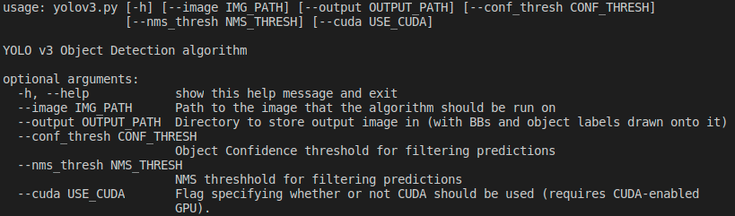
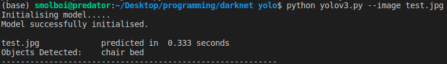
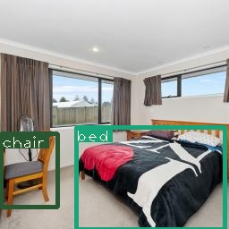

# YOLOv3 Object Detection

## Summary
This project is an implementation of the YOLOv3 object detection alogrithm using PyTorch. It utilises the same model architecture, as well as the pretrained weights, from the orginal YOLOv3 implementation. This program is thus primarily focused with the overhead operations, such as processing of the images, IoU and NMS, confidence thresholding, etc. Currently only a command-line interface is supported, however a GUI counterpart should be up soon.

## Dependencies:
* PyTorch
* NumPy
* OpenCV
* Pre-trained weights: https://pjreddie.com/media/files/yolov3.weights (put in data folder)

## Usage:

Command line arguments:

Example usage:

Input image:

Output image:

